# Current MARL Implementation Diagrams

See also: [CTDE Graph-SAC Architecture](./ctde_graph_sac_architecture.md)

This report documents the current end-to-end architecture and the baseline training path used in this repository.

## 1. System Context in the Project

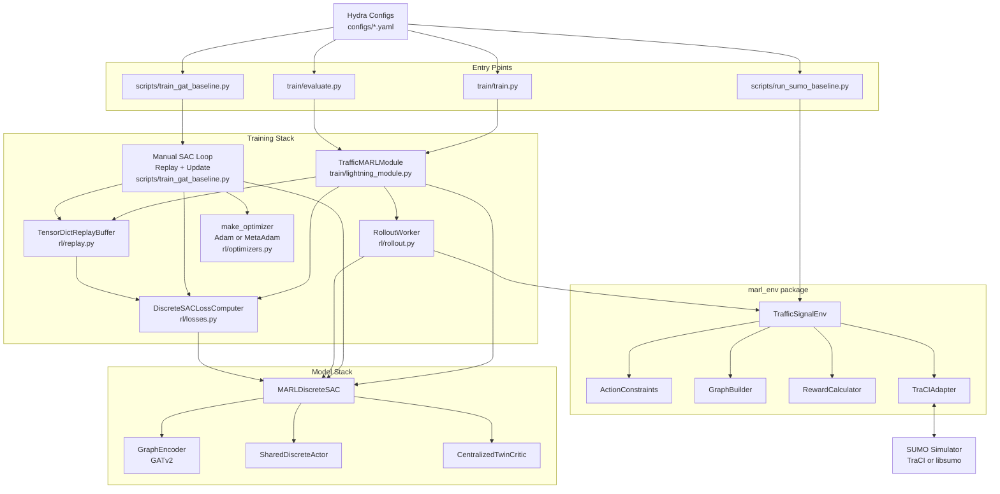

## 2. Baseline Architecture (Current)

The current baseline is `scripts/train_gat_baseline.py` with Hydra-driven config, graph encoder + Discrete SAC, and optimizer selection through `rl/optimizers.py`.

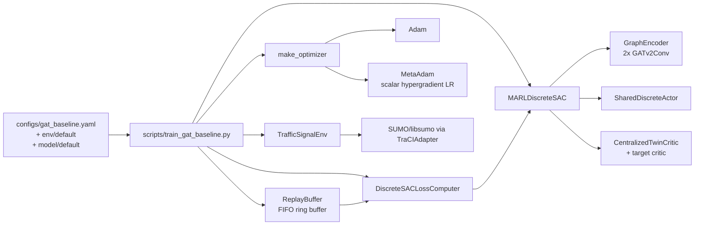

## 3. Baseline Training Loop (One Episode + Updates)

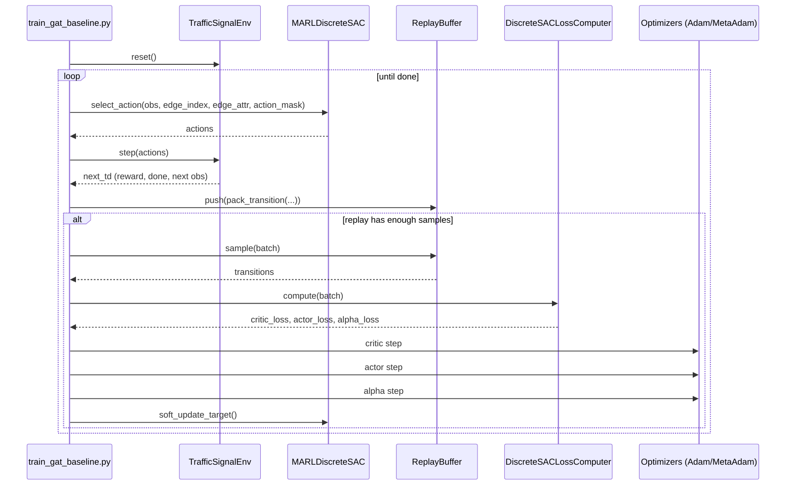

## 4. `marl_env` Internal Module Dependency Map

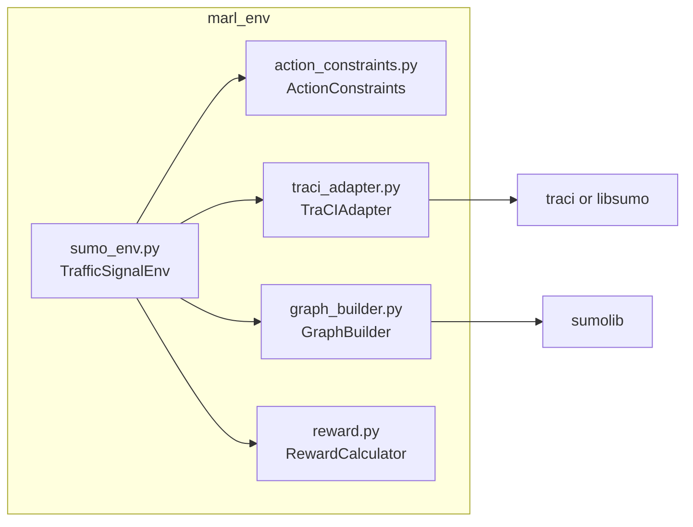

## 5. Core Class Diagram

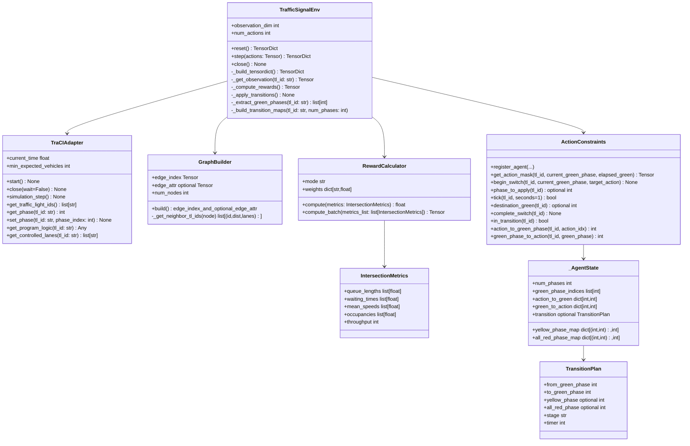

## 6. `reset()` Runtime Sequence

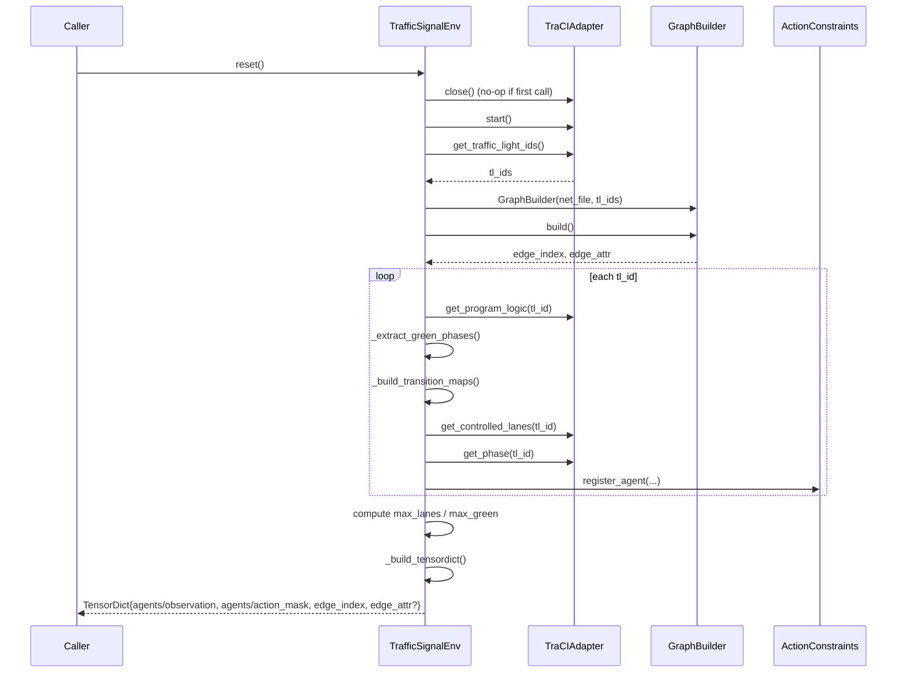

## 7. `step(actions)` Runtime Sequence

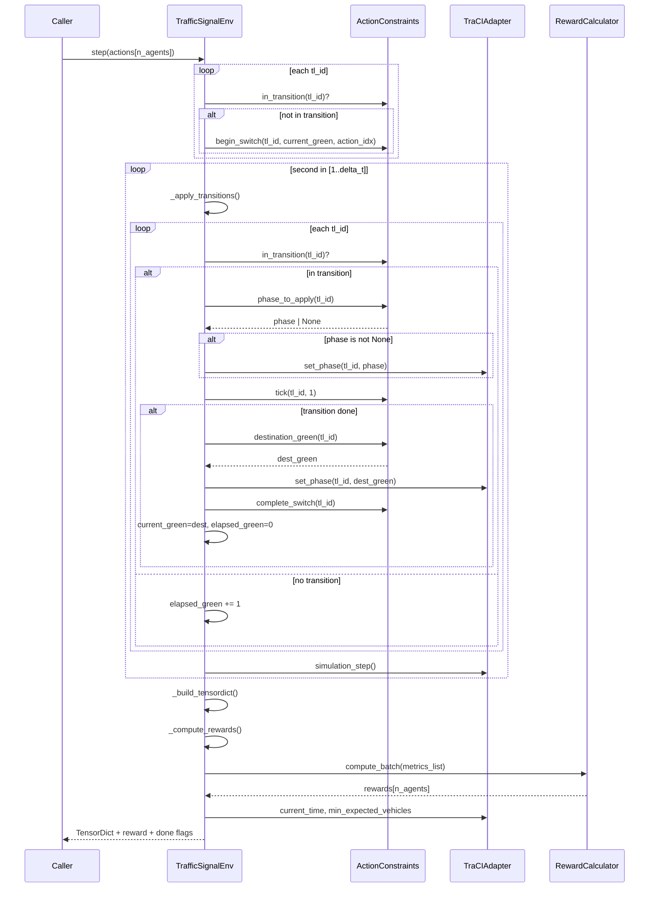

## 8. Action Transition FSM (`ActionConstraints`)

```mermaid
stateDiagram-v2
  [*] --> NoTransition

  state NoTransition {
    [*] --> Ready
  }

  NoTransition --> NoTransition: begin_switch(same green)
  NoTransition --> Yellow: begin_switch(new green, yellow exists)
  NoTransition --> AllRed: begin_switch(new green, no yellow, all-red exists)
  NoTransition --> ReadyToCommit: begin_switch(new green, no clearance phases)

  Yellow --> Yellow: tick(); timer > 0
  Yellow --> AllRed: timer <= 0 and all_red_phase exists
  Yellow --> ReadyToCommit: timer <= 0 and no all_red_phase

  AllRed --> AllRed: tick(); timer > 0
  AllRed --> ReadyToCommit: timer <= 0

  ReadyToCommit --> NoTransition: env sets destination green + complete_switch()
```

## 9. Action-Mask Decision Logic

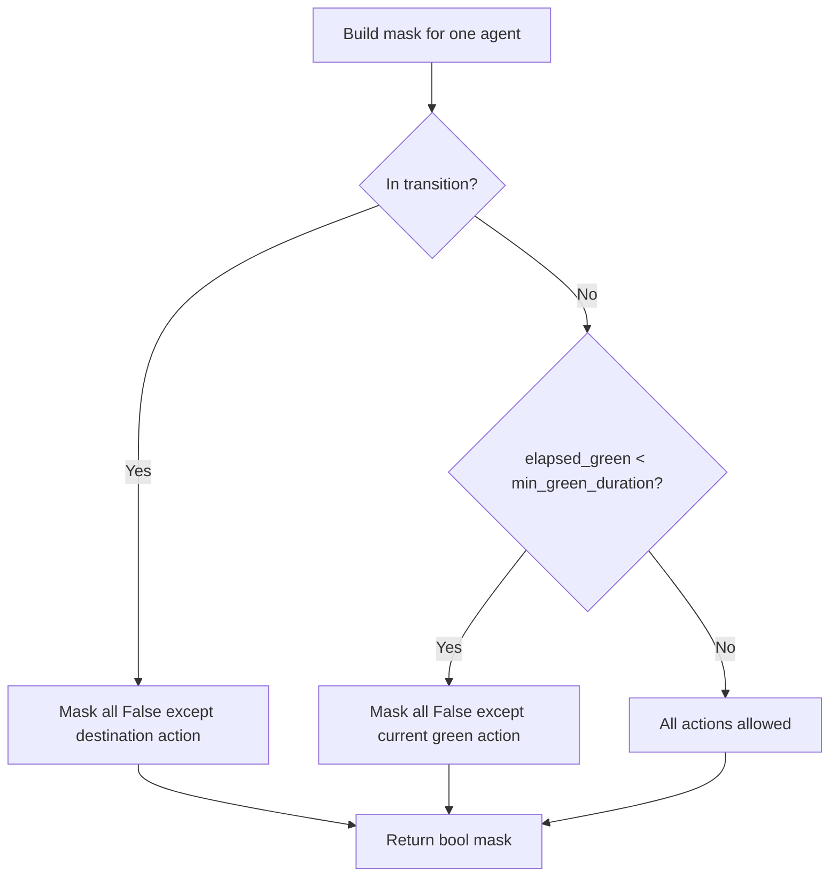

## 10. Observation Vector Construction

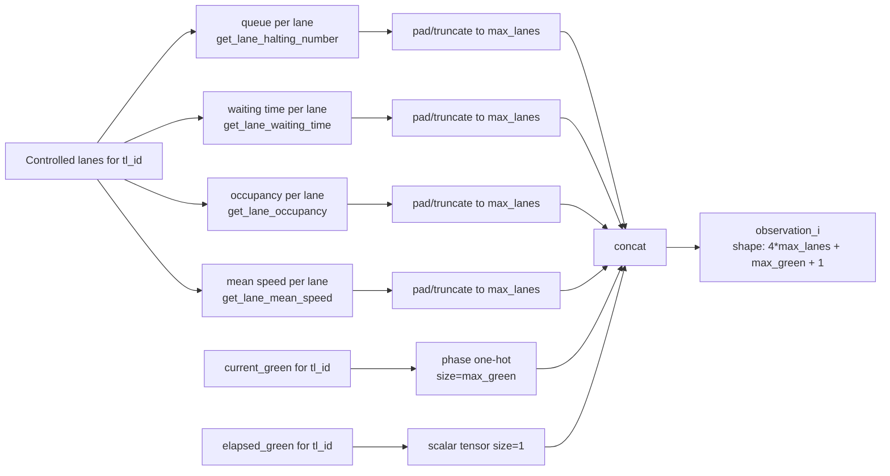

## 11. Environment Output `TensorDict` Schema

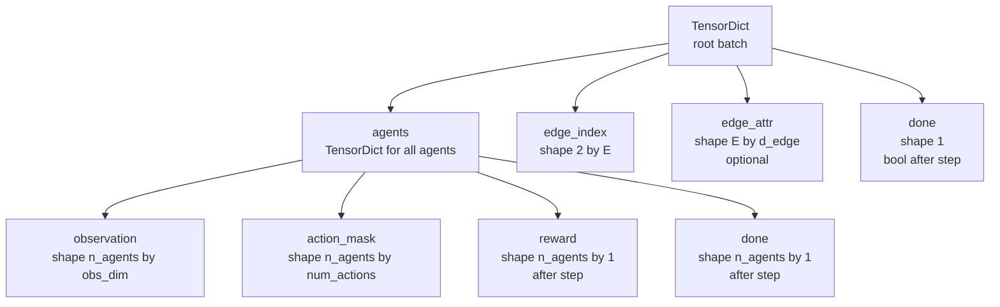

## 12. Graph Topology Build Flow (`GraphBuilder`)

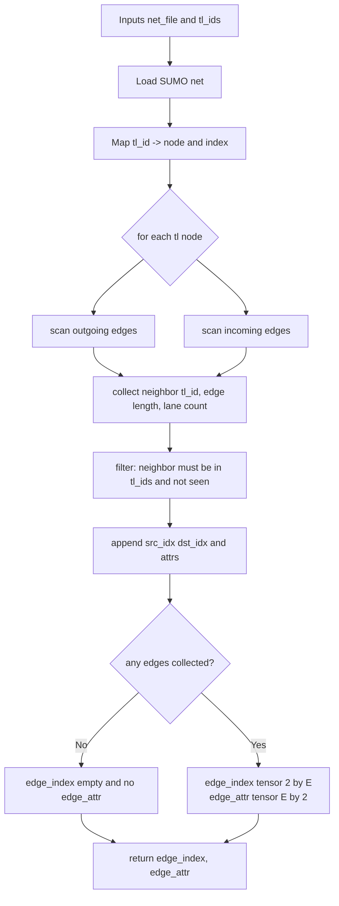

## 13. Reward Computation Flow

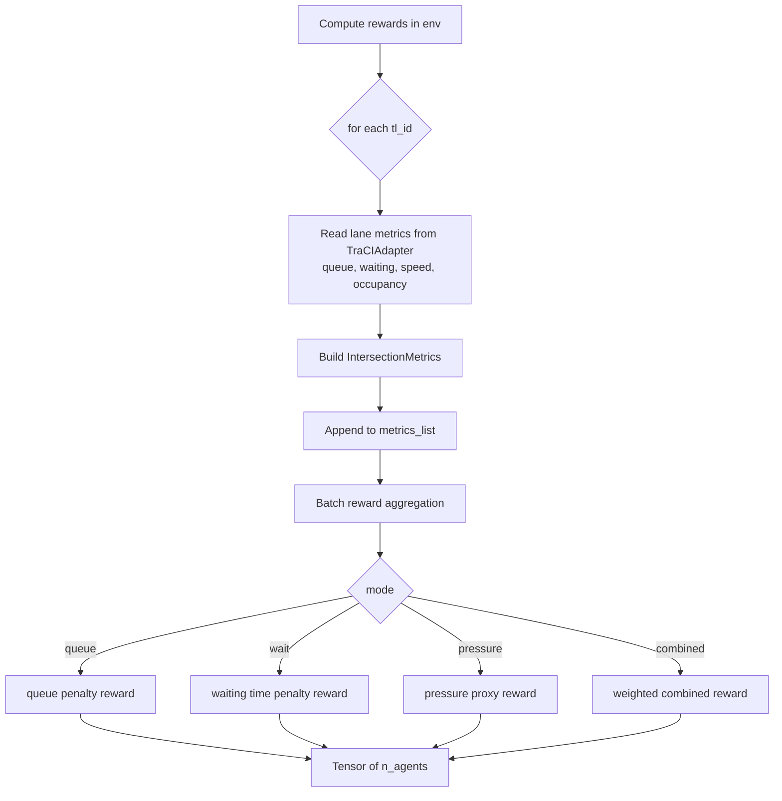

## 14. Environment Lifecycle States

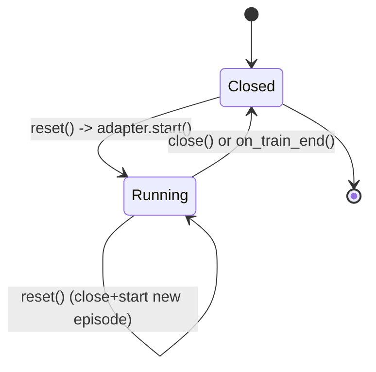
